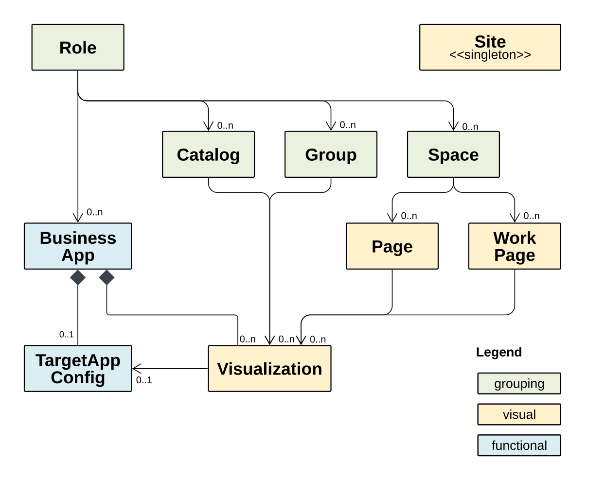

# Common Data Model (CDM) &ndash; Data Model for Application Integration

## About this project

Standardized document format to describe metadata about business applications that can be launched in a system.

## Description

The Common Data Model is used as standardized contract to integrate business solutions into SAP Build Work Zone and for other usages,
e.g. in the context of SAP Business AI. Business solutions expose a _CDM document_ as a JSON document that complies with the JSON schema of CDM to describe their launchable apps and related content. The CDM document contains the list of _CDM entities_ exposed by the business solution. Each CDM entity is founded on a JSON schema describing its attributes and behaviors.

The CDM is an evolving model. The first published version of the schema is version 3.2. The version of the schema determines which business content can be included in it.

<!-- markdownlint-disable MD033 -->
</img>

Get started by creating CDM documents based on the JSON schemas provided here.

## Contributing

The CDM development is driven by SAP internally and we don't accept external contributions for this project.

This project is only updated by SAP employees. We only accept bug reports via [GitHub issues](https://github.com/SAP/common-data-model/issues).

## Security / Disclosure

If you find any bug that may be a security problem, please follow our instructions at [in our security policy](https://github.com/SAP/common-data-model/security/policy) on how to report it. Please do not create GitHub issues for security-related doubts or problems.

## Code of Conduct

We as members, contributors, and leaders pledge to make participation in our community a harassment-free experience for everyone. By participating in this project, you agree to abide by its [Code of Conduct](https://github.com/SAP/.github/blob/main/CODE_OF_CONDUCT.md) at all times.

## Resources

### JSON Schema Files of CDM

The schema files are in folder: [schema/](./schema/).

It contains separate schema files for the model entities and the schema of a CDM document in [cdm-entities.json](./schema/cdm-entities.json)

## History

For detailed and recent changes, please refer to the [CHANGELOG.md](./CHANGELOG.md).

## Licensing

Copyright 2025 SAP SE or an SAP affiliate company and common-data-model contributors. Please see our [LICENSE](LICENSE) for copyright and license information. Detailed information including third-party components and their licensing/copyright information is available [via the REUSE tool](https://api.reuse.software/info/github.com/SAP/common-data-model).
